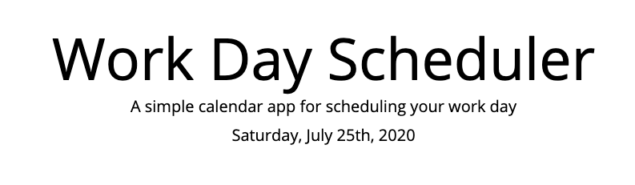
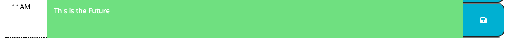
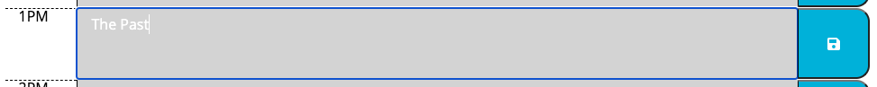
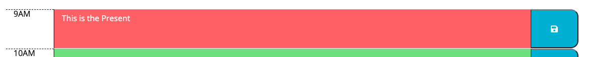
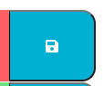

# A Day Planner that stores the events you wish to remember for that day.

## The information is Stored in localStorage in the browser

[Click to visit Website](file:///Users/milescohn/Rutgers%20Bootcamp/Portfolio/color_coded_day_planner/index.html)

The current day and date is displayed at the top

Hour Time Slots in the **future** are **Green**

Hour Time Slots in the **past** are **Grey** 

and the **current** Hour Time Slots is **Red**

**To save** the info you type in the planner, you must press the **Blue Save Button** on the right of the display area

*Note: this only saves the data in the slot it's attached to, not the whole page*
